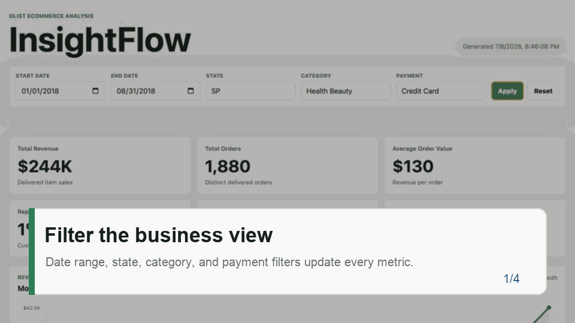
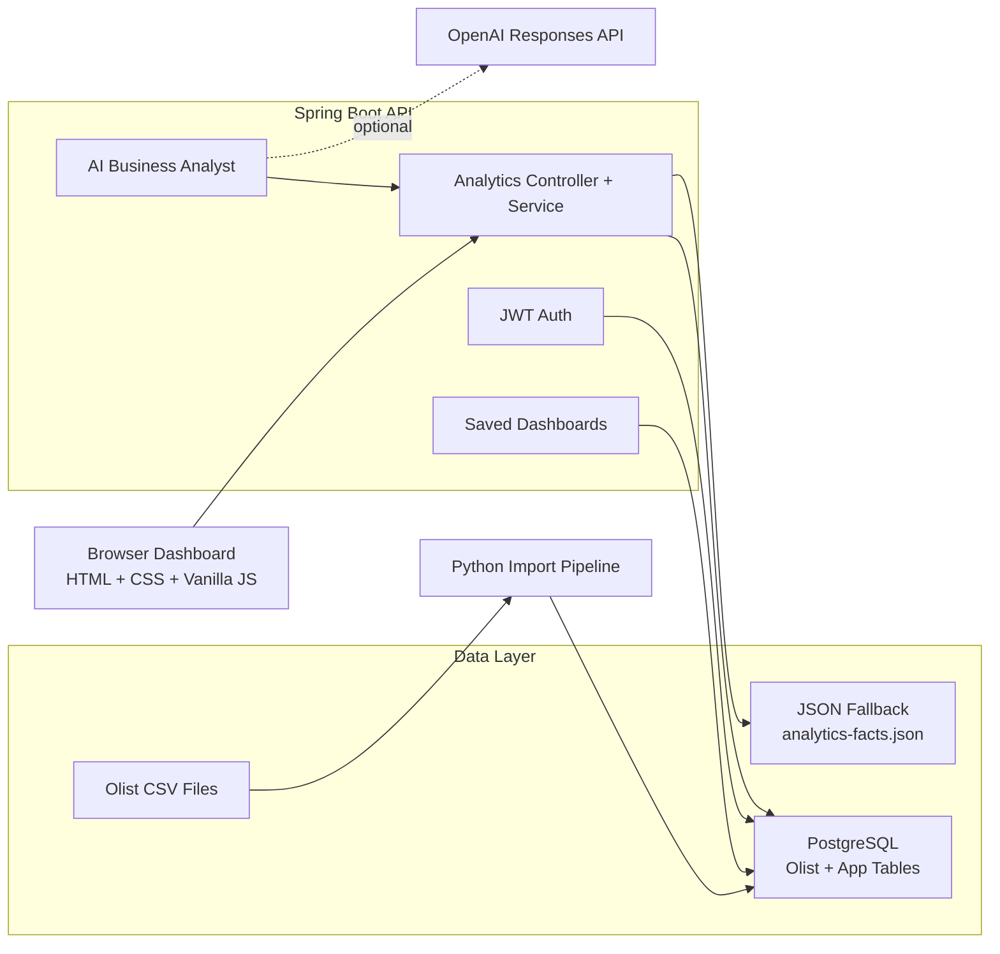
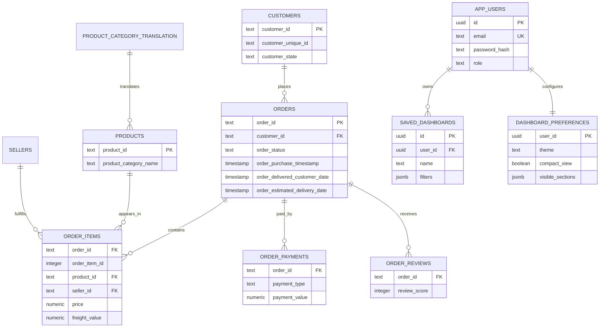

<p align="center">
  
</p>

<h1 align="center">InsightFlow</h1>

<p align="center">
  A portfolio-ready business analytics platform for ecommerce performance, powered by Spring Boot, PostgreSQL, interactive dashboards, JWT workspaces, and an AI Business Analyst.
</p>

<p align="center">
  <a href="#quick-start">Quick Start</a> ·
  <a href="#features">Features</a> ·
  <a href="#architecture">Architecture</a> ·
  <a href="#api-overview">API</a> ·
  <a href="#deployment">Deployment</a>
</p>

<p align="center">
  
  
  
  
  
  
</p>

## Overview

InsightFlow turns the public Brazilian Olist ecommerce CSV dataset into an executive analytics product. It supports PostgreSQL-backed analytics for realistic demos, JSON fallback mode for database-free walkthroughs, authentication, saved dashboards, CSV export, and an AI analyst that answers business questions from filtered metrics.

**Demo account**

```text
Email: demo@example.com
Password: portfolio-pass
```

**Live links**

| Target | URL |
| --- | --- |
| Frontend | `https://<your-render-service>.onrender.com` |
| Backend health | `https://<your-render-service>.onrender.com/api/health` |
| GitHub | `https://github.com/<your-username>/insightflow` |

## Screenshots

### Dashboard


### Demo Walkthrough



## Features

| Area | What InsightFlow Does |
| --- | --- |
| Analytics | Revenue, orders, AOV, repeat customer rate, review score, delivery delay rate, category performance, state revenue, payment mix, review distribution |
| Filters | Date range, customer state, product category, and payment type |
| Dashboard | Responsive KPI cards, chart panels, source-mode badge, empty states, and CSV export |
| Data modes | PostgreSQL analytics for realistic demos; JSON fallback for simple local or hosted demos |
| AI analyst | Executive reports and natural-language business questions with local fallback or OpenAI mode |
| Authentication | JWT login/register, BCrypt password hashing, demo account, protected workspace endpoints |
| Saved workspace | Saved dashboards and user dashboard preferences |
| Deployment | Dockerfile, Docker Compose, Render Blueprint, health check endpoint |

## Architecture



## Database Diagram



## Tech Stack

| Layer | Technology |
| --- | --- |
| Frontend | HTML, CSS, vanilla JavaScript, SVG charts |
| Backend | Java 21, Spring Boot 3.5, Spring Web |
| Security | Spring Security, JWT, BCrypt |
| Database | PostgreSQL, SQL analytics, JSONB |
| Data pipeline | Python CSV importer |
| AI | Local deterministic analyst, optional OpenAI Responses API |
| DevOps | Docker Compose, Dockerfile, Render Blueprint |
| Testing | JUnit, Spring MockMvc, AssertJ |

## Quick Start

Run the fastest local demo with JSON analytics and local AI fallback:

```bash
./scripts/run_local.sh json
```

Open:

```text
http://localhost:8080
```

This mode does not require Docker, PostgreSQL, or an API key.

## Installation

**Requirements**

- Java 21+
- Python 3.10+
- Docker Desktop, only for PostgreSQL mode
- Optional: `psql` or `psycopg[binary]` for CSV import

**Clone and configure**

```bash
git clone https://github.com/<your-username>/insightflow.git
cd insightflow
cp .env.example .env
```

## Docker Setup

Start PostgreSQL with one command:

```bash
docker compose up -d
docker compose ps
```

Docker Compose creates:

| Setting | Value |
| --- | --- |
| Database | `insightflow` |
| User | `insightflow_user` |
| Password | `insightflow_pass` |
| Port | `5432` |
| Volume | `insightflow_postgres_data` |

## PostgreSQL Setup

Import the Olist CSV files into PostgreSQL:

```bash
python3 scripts/import_olist_to_postgres.py
```

Run the backend in PostgreSQL analytics mode:

```bash
export INSIGHTFLOW_ANALYTICS_MODE=postgres
cd backend
./mvnw spring-boot:run
```

Or run everything through the helper script:

```bash
./scripts/run_local.sh postgres
```

Skip re-importing data on later starts:

```bash
./scripts/run_local.sh postgres --skip-import
```

## JSON Fallback Mode

JSON mode is useful for demos when PostgreSQL is not available.

```bash
export INSIGHTFLOW_ANALYTICS_MODE=json
cd backend
./mvnw spring-boot:run
```

Regenerate fallback analytics from CSVs:

```bash
python3 scripts/generate_analytics.py
```

Generated files are stored in `backend/src/main/resources/` and `database/`.

## AI Configuration

InsightFlow works without an AI key by using local deterministic analyst output:

```bash
export INSIGHTFLOW_AI_PROVIDER=local
```

To use OpenAI-backed responses:

```bash
export INSIGHTFLOW_AI_PROVIDER=openai
export OPENAI_API_KEY=<your-api-key>
export OPENAI_MODEL=gpt-5.5
```

The AI layer receives aggregated metrics only. It does not send raw CSV rows, passwords, database credentials, or arbitrary SQL.

## API Overview

| Method | Endpoint | Auth | Purpose |
| --- | --- | --- | --- |
| `GET` | `/api/health` | Public | Deployment health check |
| `GET` | `/api/analytics/summary` | Public | Filtered KPIs and chart datasets |
| `POST` | `/api/ai/report` | Public | Executive business report |
| `POST` | `/api/ai/query` | Public | Natural-language analytics answer |
| `POST` | `/api/auth/register` | Public | Create account and return JWT |
| `POST` | `/api/auth/login` | Public | Login and return JWT |
| `GET` | `/api/auth/me` | JWT | Current user profile |
| `GET` | `/api/dashboards` | JWT | List saved dashboards |
| `POST` | `/api/dashboards` | JWT | Save dashboard view |
| `PUT` | `/api/preferences` | JWT | Update dashboard preferences |

**Analytics example**

```bash
curl "http://localhost:8080/api/analytics/summary?state=SP&paymentType=Credit%20Card"
```

**AI example**

```bash
curl -X POST "http://localhost:8080/api/ai/query" \
  -H "Content-Type: application/json" \
  -d '{"question":"Which categories should I promote?","filters":{"state":"SP"}}'
```

**Login example**

```bash
curl -X POST "http://localhost:8080/api/auth/login" \
  -H "Content-Type: application/json" \
  -d '{"email":"demo@example.com","password":"portfolio-pass"}'
```

## Environment Variables

| Variable | Example | Purpose |
| --- | --- | --- |
| `INSIGHTFLOW_ANALYTICS_MODE` | `auto`, `postgres`, `json` | Select analytics source |
| `DATABASE_URL` | `jdbc:postgresql://localhost:5432/insightflow` | Spring JDBC URL |
| `DATABASE_USERNAME` | `insightflow_user` | Database username |
| `DATABASE_PASSWORD` | `insightflow_pass` | Database password |
| `SPRING_SQL_INIT_MODE` | `never`, `always` | Schema initialization mode |
| `INSIGHTFLOW_AI_PROVIDER` | `local`, `openai` | AI response provider |
| `OPENAI_API_KEY` | empty locally | Optional OpenAI key |
| `OPENAI_MODEL` | `gpt-5.5` | OpenAI model name |
| `INSIGHTFLOW_JWT_SECRET` | long random string | JWT signing secret |
| `INSIGHTFLOW_JWT_EXPIRATION_MINUTES` | `1440` | JWT lifetime |

Do not commit real secrets. For deployed environments, generate a strong JWT secret:

```bash
openssl rand -base64 48
```

## Project Structure

```text
insightflow/
├── backend/                         # Spring Boot API
│   └── src/main/java/com/sophia/insightflow/
│       ├── ai/                      # AI analyst endpoints and service
│       ├── analytics/               # Analytics API, DTOs, SQL repository, fallback service
│       ├── auth/                    # JWT auth, users, security config
│       ├── config/                  # Health check and deployment config
│       └── dashboard/               # Saved dashboards and preferences
├── frontend/                        # Dashboard UI
├── database/                        # Schema, SQL analysis queries, JSON fallback artifacts
├── data/                            # Olist CSV files
├── docs/                            # Screenshots, demo GIF, deployment notes
├── scripts/                         # Import, generation, and local run scripts
├── docker-compose.yml               # Local PostgreSQL
├── Dockerfile                       # Production image
├── render.yaml                      # Render Blueprint
└── README.md
```

## Deployment

InsightFlow is designed to deploy as one Spring Boot web service. The backend serves the static frontend, so the dashboard and API use the same origin in production.

Deployment files:

- `Dockerfile` builds the Spring Boot jar and bundles the frontend.
- `render.yaml` defines the Render web service, managed PostgreSQL database, generated JWT secret, and `/api/health` check.
- `docs/deployment.md` contains the deployment checklist.

Render flow:

1. Push this repository to GitHub.
2. In Render, create a new Blueprint from `render.yaml`.
3. Keep `INSIGHTFLOW_ANALYTICS_MODE=json` for an instant demo, or switch to `postgres` after importing hosted data.
4. Add `OPENAI_API_KEY` only if you want OpenAI-backed analyst responses.
5. Replace the placeholder live links at the top of this README.

## Testing

Run backend tests:

```bash
cd backend
./mvnw test
```

Run the frontend syntax check:

```bash
node --check frontend/src/app.js
```

Current tests cover analytics calculations, filtered API behavior, PostgreSQL repository wiring, JSON fallback behavior, AI endpoints, JWT auth, saved dashboards, preferences, and public deployment endpoints.

## Troubleshooting

| Problem | Fix |
| --- | --- |
| Dashboard shows JSON fallback | Start PostgreSQL, import data, and set `INSIGHTFLOW_ANALYTICS_MODE=postgres` or `auto` |
| PostgreSQL connection fails | Check Docker status, port `5432`, and `.env` database values |
| Import script needs a driver | Install `psql` or run `python3 -m pip install 'psycopg[binary]'` |
| Demo login fails in PostgreSQL mode | Re-run `python3 scripts/import_olist_to_postgres.py`; schema seeds the demo user |
| AI returns local output | Set `INSIGHTFLOW_AI_PROVIDER=openai` and provide `OPENAI_API_KEY` |
| Static frontend calls wrong API | Use `http://localhost:8080`, or add `?api=http://localhost:8080` in static mode |

## Future Roadmap

- Testcontainers integration tests with real PostgreSQL.
- CI/CD pipeline with deployment previews.
- Managed migrations with Flyway or Liquibase.
- Team workspaces and dashboard sharing.
- Scheduled executive reports.
- AI report history per user.
- Chart image export.
- Refresh tokens and password reset flow.

## Resume Bullet Points

- Built a full-stack ecommerce analytics platform with Java 21, Spring Boot, PostgreSQL, Docker, and vanilla JavaScript.
- Designed a Python import pipeline to load raw Olist CSV files into normalized PostgreSQL tables for SQL-backed analytics.
- Implemented dashboard filters, KPI calculations, revenue trends, category rankings, regional revenue, payment mix, review distribution, and delivery-delay analysis.
- Added JSON fallback mode so the dashboard remains demo-ready when PostgreSQL is unavailable.
- Built a responsive dashboard with interactive charts, source-mode indicators, empty states, saved views, preferences, and CSV export.
- Integrated JWT authentication with BCrypt password hashing and protected user workspace endpoints.
- Added an AI Business Analyst for executive reports and natural-language metric questions with local and OpenAI-backed modes.
- Created Docker Compose, Render deployment configuration, health checks, and automated tests covering analytics, auth, AI, fallback behavior, and API routes.
