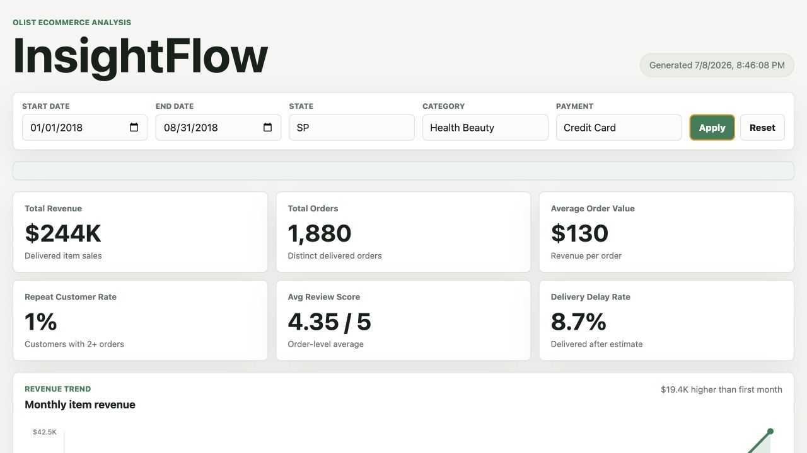
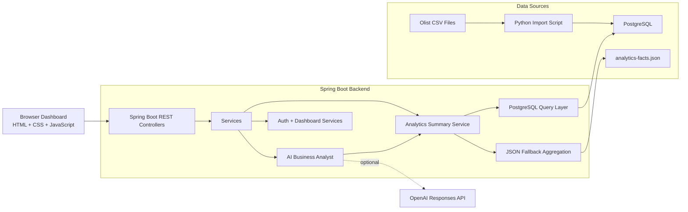
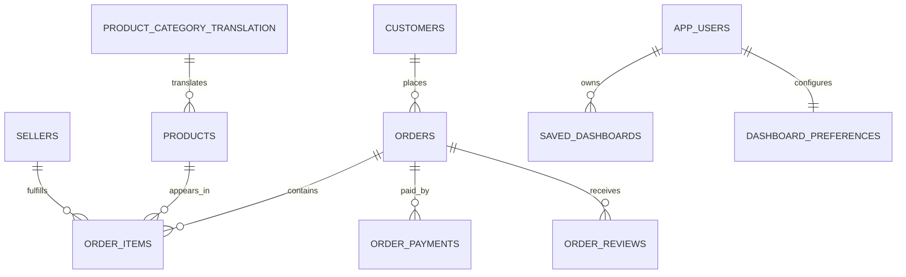

<p align="center"></p>

<h1 align="center">InsightFlow</h1>

<p align="center">
  Full-stack business analytics platform for Olist ecommerce data with PostgreSQL analytics, JSON fallback mode, JWT workspaces, and a hybrid analytics assistant.
</p>

<p align="center">
  
  
  
  
  
  
</p>

## 🔗 Links

| Resource | Link |
| --- | --- |
| GitHub Repository | [github.com/syzackerman/insightflow](https://github.com/syzackerman/insightflow) |

## 📌 Overview

InsightFlow is a portfolio-ready analytics application built around the Brazilian Olist ecommerce dataset. It turns raw order, customer, product, payment, review, and delivery CSV files into filtered business metrics and interactive dashboard views.

Designed as a production-style portfolio project to demonstrate backend engineering, REST API design, SQL analytics, authentication, Docker deployment, and AI integration.

The backend is a Java 21 Spring Boot API with a PostgreSQL query layer, DTO-based responses, JWT authentication, saved dashboards, dashboard preferences, health checks, and test coverage for analytics, auth, AI, and deployment endpoints.

The frontend is a lightweight HTML/CSS/JavaScript dashboard with KPI cards, SVG charts, filters, loading/error/empty states, CSV export, user workspace controls, and analyst prompts.

InsightFlow supports two analytics modes: PostgreSQL mode for realistic SQL-backed analysis, and JSON fallback mode for demos when a database is unavailable. It also includes a hybrid analytics assistant with deterministic local output and optional OpenAI Responses API integration.

## 🎯 Key Skills Demonstrated

Java · Spring Boot · REST API Design · PostgreSQL · SQL Analytics · JWT Authentication · Docker · Data Engineering · AI Integration · Business Analytics

## ✨ Highlights

- 📊 Analyzes 100K+ real-world Olist e-commerce transactions.
- 🧮 Calculates revenue, orders, AOV, repeat customers, reviews, delays, categories, states, payments, and monthly trends.
- 🗄️ Runs PostgreSQL-backed analytics with filtered SQL queries.
- 🧾 Provides JSON fallback mode with the same `/api/analytics/summary` response shape.
- 🖥️ Includes an interactive dashboard with KPI cards, filters, charts, source badge, and CSV export.
- 🤖 Provides a hybrid analytics assistant with deterministic local answers and optional OpenAI Responses API output.
- 🔐 Supports JWT authentication with BCrypt password hashing.
- 💾 Saves user dashboards and dashboard preferences.
- 🐳 Ships Docker Compose PostgreSQL setup with persistent volume and healthcheck.
- 🚢 Includes Render deployment configuration and a production health endpoint.

## 🧱 Architecture



The dashboard calls the Spring Boot API directly. Controllers handle HTTP requests, services own business workflows, repositories isolate SQL and fallback data access, and DTO records keep response contracts explicit. PostgreSQL mode runs analytical SQL, while JSON mode reads generated aggregate facts with the same frontend contract.

Authentication is stateless. The frontend stores a JWT and sends it to protected dashboard and preference endpoints. Analytics and AI endpoints are public for an easy portfolio demo.

## 🗄️ Database Design



The database schema lives in `database/schema.sql`. It includes normalized Olist tables for ecommerce analytics and application tables for users, saved dashboards, and dashboard preferences.

The analytics query layer joins orders, customers, items, products, payments, and review rollups to calculate dashboard metrics. Indexes support common filters such as order date, order status, customer state, product, payment type, and saved dashboard lookup.

## 🛠️ Tech Stack

| Layer | Technology |
| --- | --- |
| Frontend | HTML, CSS, vanilla JavaScript, SVG charts |
| Backend | Java 21, Spring Boot 3.5, Spring Web |
| Security | Spring Security, JWT, BCrypt |
| Database | PostgreSQL, SQL, JSONB |
| Data Pipeline | Python CSV import and JSON generation scripts |
| AI | Local deterministic analyst, optional OpenAI Responses API |
| DevOps | Docker Compose, Dockerfile, Render Blueprint |
| Testing | JUnit, Spring MockMvc, Mockito, AssertJ |

## 📊 Local Benchmarks

| Benchmark | Result |
| --- | --- |
| Filtered analytics API | 171 ms average across 20 local requests |
| Full analytics generation | 7.8 seconds |
| Backend tests | 20 passed, 0 failed |

API latency was measured using 20 identical curl requests and averaged with awk. Analytics generation time was measured using the Unix time command. Results are from a local development environment and are not production guarantees.

See `docs/benchmark-results.md` for methodology and detailed results.

## ⚙️ Installation

### Quick Start

Run the app in JSON fallback mode:

```bash
./scripts/run_local.sh json
```

Open:

```text
http://localhost:8080
```

This mode uses the generated JSON resources already included in the backend and does not require PostgreSQL.

### Dataset Download

Download the Brazilian Olist ecommerce dataset from Kaggle:

```text
https://www.kaggle.com/datasets/olistbr/brazilian-ecommerce
```

Place the CSV files in `data/`. The `data/` directory is ignored by Git. Required files: `olist_customers_dataset.csv`, `olist_orders_dataset.csv`, `olist_order_items_dataset.csv`, `olist_order_payments_dataset.csv`, `olist_order_reviews_dataset.csv`, `olist_products_dataset.csv`, `olist_sellers_dataset.csv`, and `product_category_name_translation.csv`.

### JSON Mode

Regenerate fallback analytics from CSV files, then run the backend:

```bash
python3 scripts/generate_analytics.py
export INSIGHTFLOW_ANALYTICS_MODE=json
cd backend
./mvnw spring-boot:run
```

### PostgreSQL Mode

Start PostgreSQL, import CSVs, then run the backend:

```bash
docker compose up -d
python3 scripts/import_olist_to_postgres.py
export INSIGHTFLOW_ANALYTICS_MODE=postgres
cd backend
./mvnw spring-boot:run
```

Or use the helper script:

```bash
./scripts/run_local.sh postgres
./scripts/run_local.sh postgres --skip-import
```

### Docker Setup

`docker-compose.yml` provides PostgreSQL on port `5432` with database `insightflow`, user `insightflow_user`, password `insightflow_pass`, and persistent volume `insightflow_postgres_data`.

## 🔌 REST API

| Method | Endpoint | Auth | Description |
| --- | --- | --- | --- |
| `GET` | `/api/health` | Public | Health check |
| `GET` | `/api/analytics/summary` | Public | Filtered KPIs and chart datasets |
| `POST` | `/api/ai/report` | Public | Executive report |
| `POST` | `/api/ai/query` | Public | Natural-language analytics answer |
| `POST` | `/api/auth/register` | Public | Create account and return JWT |
| `POST` | `/api/auth/login` | Public | Login and return JWT |
| `GET` | `/api/auth/me` | JWT | Current user profile |
| `GET` | `/api/dashboards` | JWT | List saved dashboards |
| `POST` | `/api/dashboards` | JWT | Save dashboard |
| `PUT` | `/api/dashboards/{dashboardId}` | JWT | Update saved dashboard |
| `DELETE` | `/api/dashboards/{dashboardId}` | JWT | Delete saved dashboard |
| `GET` | `/api/preferences` | JWT | Get dashboard preferences |
| `PUT` | `/api/preferences` | JWT | Update dashboard preferences |

Analytics filters:

| Query Param | Example |
| --- | --- |
| `startDate` | `2018-01-01` |
| `endDate` | `2018-08-31` |
| `state` | `SP` |
| `category` | `Health Beauty` |
| `paymentType` | `Credit Card` |

Example request:

```bash
curl "http://localhost:8080/api/analytics/summary?state=SP&paymentType=Credit%20Card"
```

Example response:

```json
{
  "generatedAt": "2026-07-09T00:00:00Z",
  "source": "PostgreSQL-backed Brazilian Olist ecommerce dataset",
  "filters": { "state": "SP", "paymentType": "Credit Card" },
  "kpis": {
    "totalRevenue": 4035524.63,
    "totalOrders": 31159,
    "averageOrderValue": 129.51,
    "repeatCustomerRate": 3.0,
    "averageReviewScore": 4.25,
    "deliveryDelayRate": 5.4
  },
  "revenueByMonth": [],
  "topCategories": [],
  "empty": false
}
```

## 📁 Project Structure

```text
insightflow/
├── backend/                  # Spring Boot API, services, repositories, DTOs, tests
├── frontend/                 # Static dashboard UI
├── database/                 # Schema, reference SQL, generated JSON analytics
├── docs/                     # Screenshots, demo GIF, deployment notes
├── scripts/                  # CSV import, JSON generation, local run helper
├── data/                     # Local Olist CSV files; ignored by Git
├── docker-compose.yml        # Local PostgreSQL
├── Dockerfile                # Production image
├── render.yaml               # Render Blueprint
└── README.md
```

## ✅ Testing

Commands:

```bash
cd backend
./mvnw test
```

Run the frontend syntax check:

```bash
node --check frontend/src/app.js
```

Tested areas:

- Analytics calculations and filtered API responses
- PostgreSQL query wiring and JSON fallback behavior
- AI endpoints, deterministic local output, and optional OpenAI integration behavior
- JWT registration/login and protected workspace routes
- Saved dashboards, preferences, and public deployment endpoints

## 🚢 Deployment

### Docker Compose

Docker Compose is used for local PostgreSQL:

```bash
docker compose up -d
python3 scripts/import_olist_to_postgres.py
```

The Spring Boot backend is run separately with `./mvnw spring-boot:run`.

### Render

`render.yaml` defines a Render web service, PostgreSQL database, generated JWT secret, production profile, and `/api/health` health check.

Recommended Render flow:

1. Push this repository to GitHub.
2. Create a Render Blueprint from `render.yaml`.
3. Keep `INSIGHTFLOW_ANALYTICS_MODE=json` for the fastest public demo.
4. Switch to `postgres` only after importing data into the hosted database.

### Environment Variables

| Variable | Purpose |
| --- | --- |
| `INSIGHTFLOW_ANALYTICS_MODE` | `auto`, `postgres`, or `json` |
| `DATABASE_URL` | JDBC or Render PostgreSQL connection URL |
| `DATABASE_USERNAME` | PostgreSQL username |
| `DATABASE_PASSWORD` | PostgreSQL password |
| `SPRING_SQL_INIT_MODE` | Schema initialization mode |
| `INSIGHTFLOW_AI_PROVIDER` | `local`, `openai`, or `auto` |
| `OPENAI_API_KEY` | Optional OpenAI API key |
| `OPENAI_MODEL` | OpenAI model name |
| `INSIGHTFLOW_JWT_SECRET` | JWT signing secret |
| `INSIGHTFLOW_JWT_EXPIRATION_MINUTES` | JWT lifetime |

Never commit real secrets. See `.env.example` for local defaults.

## 🗺️ Roadmap

Completed:

- [x] Spring Boot backend
- [x] PostgreSQL analytics
- [x] JWT authentication
- [x] Hybrid analytics assistant
- [x] Interactive dashboard
- [x] Docker deployment files
- [x] CSV export

Planned:

- [ ] GitHub Actions CI/CD
- [ ] Redis caching
- [ ] Kubernetes deployment
- [ ] OpenAPI/Swagger
- [ ] Real-time analytics

## 🤝 Contributing

Contributions are welcome for bug fixes, documentation improvements, tests, and small maintainability upgrades.

```bash
git checkout -b feature/your-change
cd backend
./mvnw test
```

Please keep changes focused and avoid committing `.env`, build artifacts, or files under `data/`.

## 📄 License

No license file has been added yet. Add a license before accepting external contributions or reusing this project outside portfolio/demo contexts.
